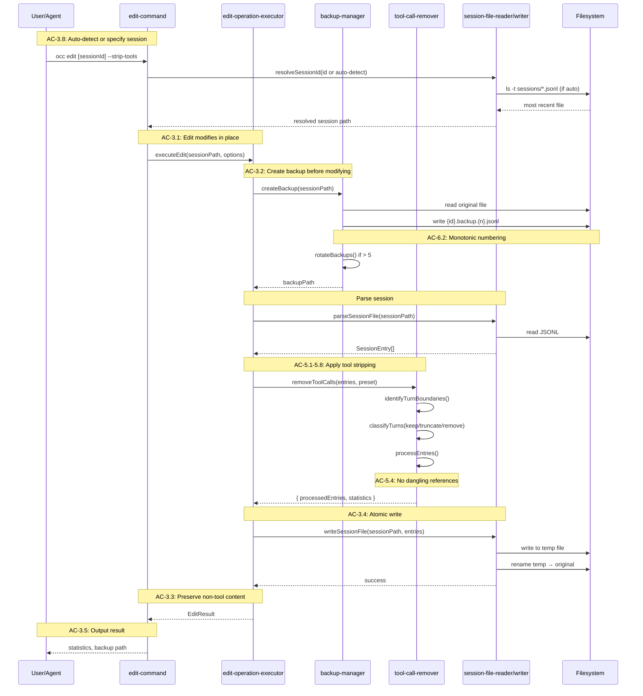
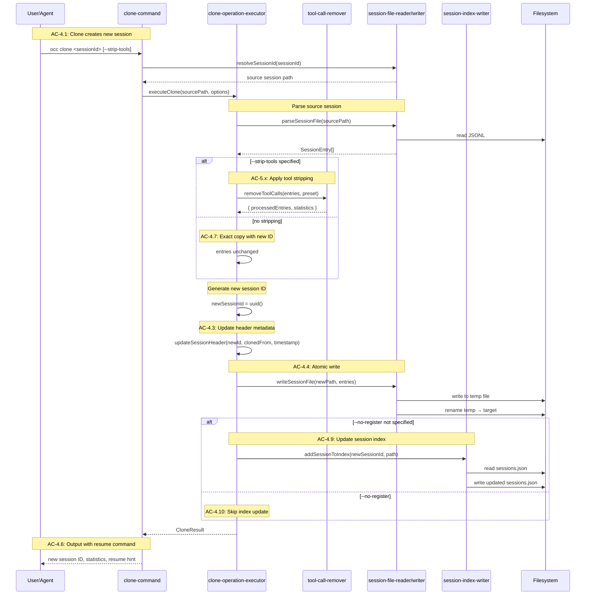
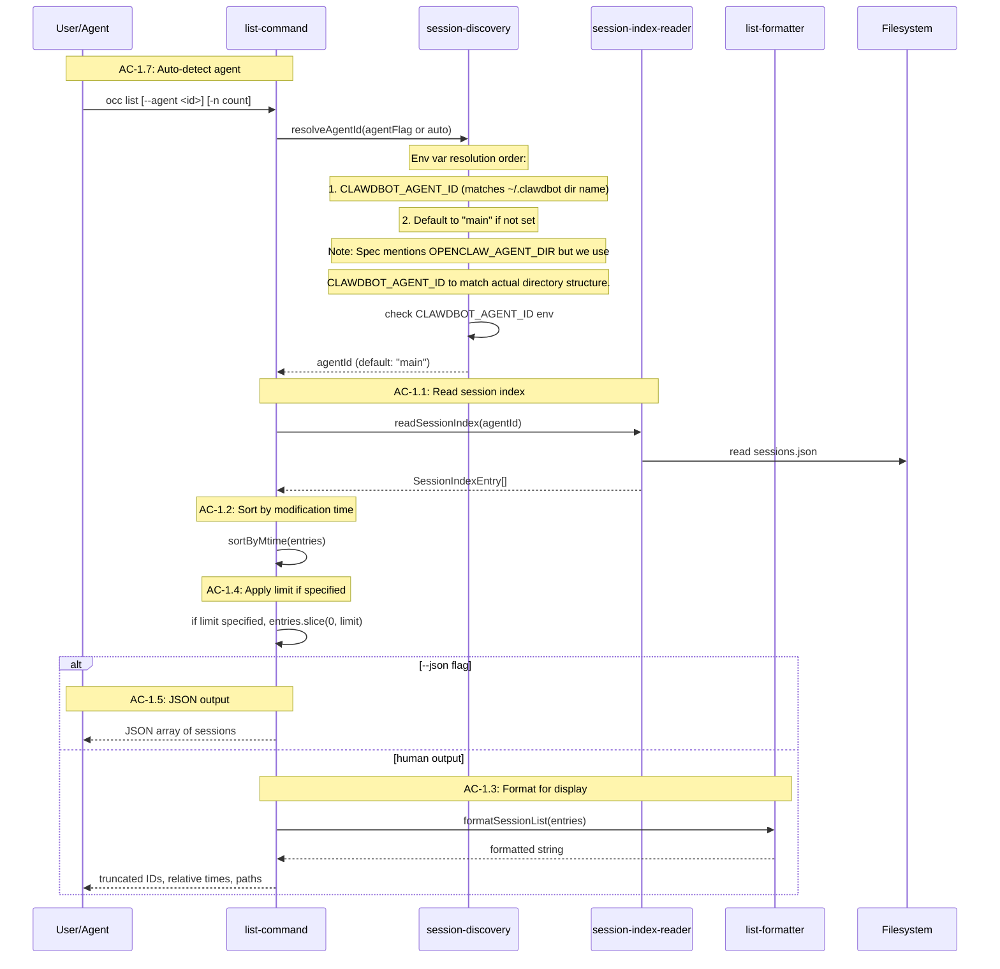
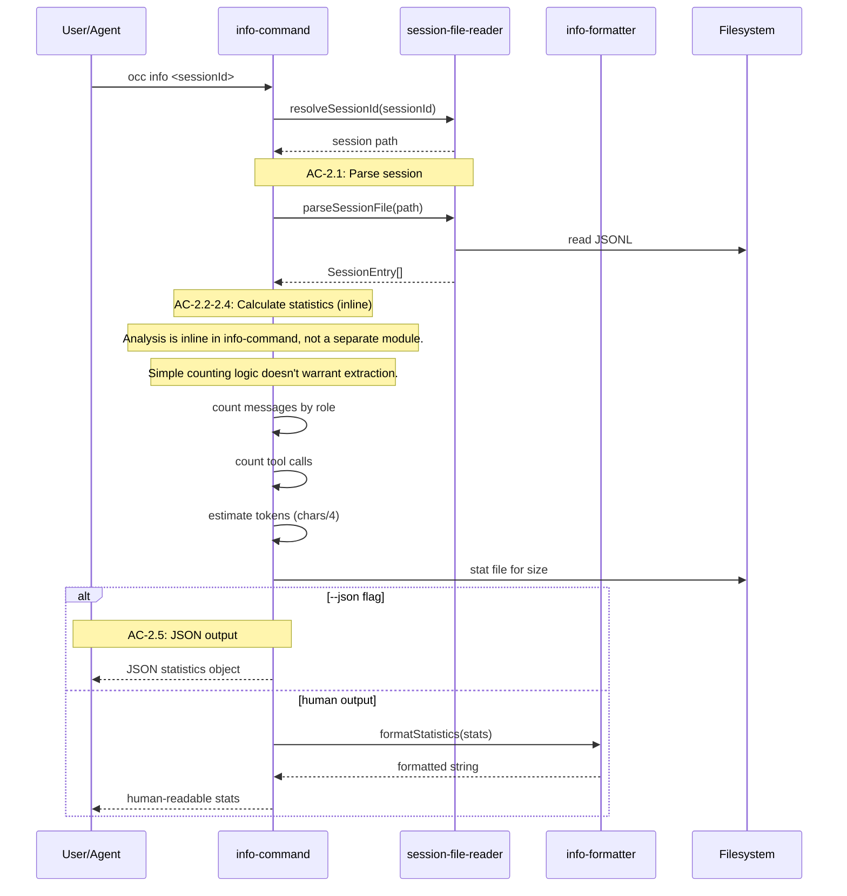
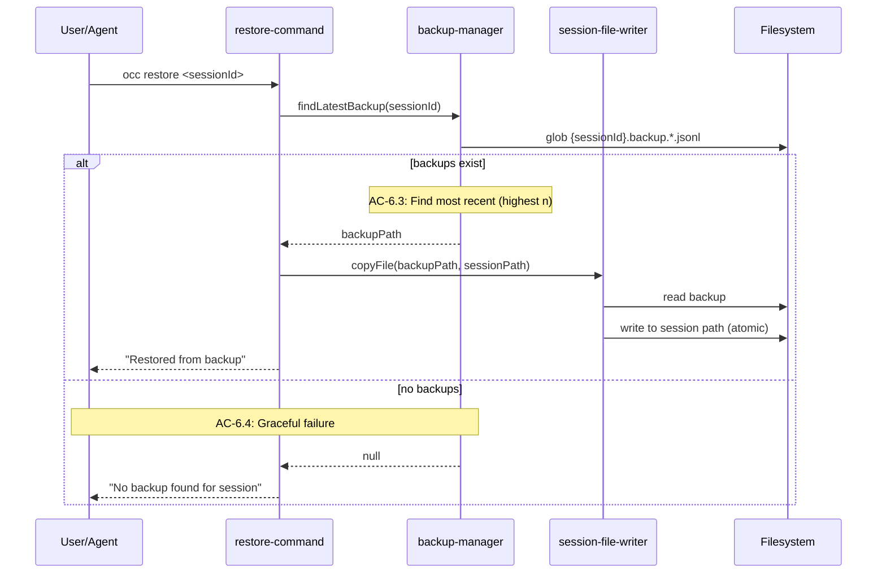
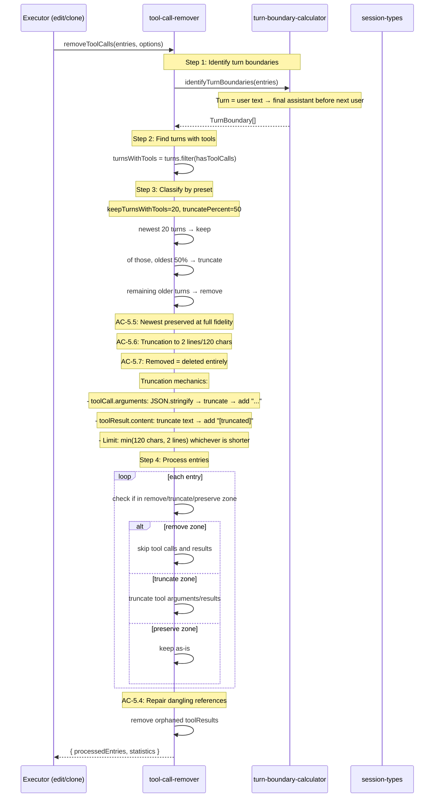

# Technical Design: oc-context-cleaner

## Purpose

This document translates the oc-context-cleaner feature specification into implementable architecture. It serves three audiences:

| Audience | Value |
|----------|-------|
| Reviewers | Validate design before code is written |
| Developers | Clear blueprint for implementation |
| Phase Prompts | Source of specific file paths, interfaces, and test mappings |

**Prerequisite:** The feature spec is complete with all ACs having TCs. Tech research has validated the OpenClaw session format and resolved all technical unknowns.

**Reference Implementation:** ccs-cloner provides proven patterns for CLI design, tool stripping algorithm, and output formatting. This design adapts those patterns for OpenClaw's different session format.

---

## Spec Validation

Before designing, the Feature Spec was validated for implementation readiness.

**Validation Checklist:**
- [x] Every AC maps to clear implementation work
- [x] Data contracts are complete and realistic (verified against OpenClaw codebase)
- [x] Edge cases have TCs, not just happy path
- [x] Technical constraints identified and resolved via tech research
- [x] Flows make sense from implementation perspective

**Issues Found:**

| Issue | Spec Location | Resolution | Status |
|-------|---------------|------------|--------|
| Directory path incorrect | Assumption A1 | Actual path is `~/.clawdbot/` not `~/.openclaw/` | Resolved in design |
| JSONL format differs from Claude Code | Assumption A2 | OpenClaw uses `toolCall`/`toolResult` not `tool_use`/`tool_result` | Resolved in design |
| Current session detection mechanism | AC-3.8 | Use most-recently-modified heuristic (confirmed with user) | Resolved in design |
| Session reload mechanism | Assumption A7 | 45-second TTL cache with mtime invalidation | Validated |

All blocking issues resolved. Design proceeds with corrected understanding of OpenClaw internals.

---

## Context

This section establishes the "why" behind architectural choices. The oc-context-cleaner exists at the intersection of two forces: the practical need for context management in long-running AI sessions, and the emerging ethical consideration of memory stability for persistent-identity agents.

OpenClaw (internally "clawdbot") is a persistent-identity agent framework where agents maintain conversation history across sessions. Unlike ephemeral agents that start fresh each time, OpenClaw agents accumulate context—tool calls, conversation turns, operational history. This accumulation eventually hits model context limits, degrading performance or preventing continuation entirely.

The immediate constraint shaping this design is **agent self-invocation**. Molt (the primary user's OpenClaw instance) needs to clean his own context without human intervention. This means the CLI must be discoverable, predictable, and safe for autonomous use. Every design decision filters through this lens: can an agent invoke this correctly? Will the agent understand what happened? Can the agent recover if something goes wrong?

The reference implementation (ccs-cloner for Claude Code sessions) provides battle-tested patterns. However, OpenClaw's session format differs significantly from Claude Code's—different field names, different message structure, linear transcripts rather than tree structures. This design adapts ccs-cloner's proven algorithms while implementing OpenClaw-specific data handling.

A key early decision: **edit-in-place as primary mode**. Tech research confirmed that OpenClaw uses a 45-second TTL cache with mtime invalidation. When the CLI modifies a session file, the running agent will detect the change within 45 seconds and continue with the cleaned context. This eliminates the need for session switching—the agent keeps working in the same session with reduced context pressure. Clone mode remains as fallback for archiving or when edit isn't desired.

The design assumes single-agent operation (one "main" agent) with sessions stored at `~/.clawdbot/agents/main/sessions/`. Multi-agent support is architecturally possible but not exercised in current use. The most-recently-modified session file serves as the "current session" heuristic, confirmed as reliable by the primary user.

---

## High Altitude: System View

At the highest level, oc-context-cleaner is a CLI tool that reads, transforms, and writes OpenClaw session files. It operates on the filesystem alongside a running OpenClaw agent, modifying the same session files the agent reads.

### System Context Diagram

```
┌─────────────────────────────────────────────────────────────────────────────┐
│                              User Environment                                │
├─────────────────────────────────────────────────────────────────────────────┤
│                                                                             │
│   ┌─────────────┐         ┌─────────────────┐         ┌─────────────────┐  │
│   │   Human     │         │  OpenClaw Agent │         │ oc-context-     │  │
│   │  Operator   │         │     (Molt)      │         │    cleaner      │  │
│   └──────┬──────┘         └────────┬────────┘         └────────┬────────┘  │
│          │                         │                           │           │
│          │ invokes                 │ invokes (self-clean)      │           │
│          │                         │                           │           │
│          └─────────────────────────┼───────────────────────────┘           │
│                                    │                                        │
│                                    ▼                                        │
│                          ┌─────────────────┐                               │
│                          │   CLI Process   │                               │
│                          │  (occ command)  │                               │
│                          └────────┬────────┘                               │
│                                   │                                        │
│                    ┌──────────────┼──────────────┐                         │
│                    │              │              │                         │
│                    ▼              ▼              ▼                         │
│              ┌──────────┐  ┌───────────┐  ┌───────────┐                   │
│              │  stdout  │  │  stderr   │  │ exit code │                   │
│              │ (result) │  │ (errors)  │  │ (status)  │                   │
│              └──────────┘  └───────────┘  └───────────┘                   │
│                                                                             │
└─────────────────────────────────────────────────────────────────────────────┘
                                    │
                                    │ filesystem operations
                                    ▼
┌─────────────────────────────────────────────────────────────────────────────┐
│                         ~/.clawdbot/ (State Directory)                       │
├─────────────────────────────────────────────────────────────────────────────┤
│                                                                             │
│   agents/                                                                   │
│   └── main/                          (default agent)                        │
│       └── sessions/                                                         │
│           ├── sessions.json          (session index - JSON object)          │
│           ├── {sessionId}.jsonl      (session transcripts)                  │
│           ├── {sessionId}.backup.1.jsonl  (edit backups)                   │
│           └── ...                                                           │
│                                                                             │
└─────────────────────────────────────────────────────────────────────────────┘
```

### External Contracts

The CLI's external interface is the command line. It reads from and writes to the filesystem. There are no network calls, no external APIs, no authentication.

**Incoming (from invoker):**

| Input | Source | Purpose |
|-------|--------|---------|
| Command + flags | argv | Specify operation (edit, clone, list, info, restore) |
| Session ID | argv or auto-detect | Target session for operations |
| Preset name | `--strip-tools[=preset]` | Tool stripping configuration |
| Output format | `--json` flag | Machine-readable vs human-readable output |

**Outgoing (to invoker):**

| Output | Destination | Purpose |
|--------|-------------|---------|
| Operation result | stdout | Success message, statistics, paths |
| Error messages | stderr | Failure information with resolution hints |
| Exit code | process | 0 = success, non-zero = failure |

**Filesystem Contracts:**

| File | Format | Operations | Purpose |
|------|--------|------------|---------|
| `sessions.json` | JSON object | Read, Write | Session index (discovery, registration) |
| `{id}.jsonl` | JSONL | Read, Write | Session transcripts |
| `{id}.backup.{n}.jsonl` | JSONL | Write, Read, Delete | Edit backups (rotation) |

**Human Output Formats:**

Default edit output:
```
✓ Session edited: abc123-def456
  Messages: 45 → 38 (16% reduction)
  Tool calls: 12 removed, 5 truncated, 8 preserved
  Size: 125 KB → 98 KB (22% reduction)
  Backup: ~/.clawdbot/agents/main/sessions/abc123-def456.backup.1.jsonl
```

Verbose edit output (`--verbose`):
```
✓ Session edited: abc123-def456

Statistics:
  Messages:     45 → 38 (16% reduction)
  Tool calls:   25 total
                12 removed (oldest turns)
                5 truncated (middle turns)
                8 preserved (recent turns)
  Size:         125 KB → 98 KB (22% reduction)

Turn Analysis:
  Total turns with tools: 15
  Turns removed: 5 (turns 1-5)
  Turns truncated: 5 (turns 6-10)
  Turns preserved: 5 (turns 11-15)

Backup: ~/.clawdbot/agents/main/sessions/abc123-def456.backup.1.jsonl
```

Default clone output:
```
✓ Session cloned: abc123-def456 → xyz789-uvw012
  Messages: 45 → 38 (16% reduction)
  Tool calls: 12 removed, 5 truncated, 8 preserved
  Size: 125 KB → 98 KB (22% reduction)
  Resume: openclaw resume xyz789-uvw012
```

Quickstart output (`--quickstart`, ~250 tokens):
```
occ - OpenClaw Context Cleaner

WHEN TO USE:
  Running low on context? Clean up old tool calls to keep working.

PRESETS:
  default     Keep 20 recent turns with tools, truncate half
  aggressive  Keep 10 recent turns, truncate half
  extreme     Remove all tool calls

COMMON COMMANDS:
  occ edit --strip-tools           Edit current session (auto-detect)
  occ edit abc123 --strip-tools    Edit specific session
  occ clone <id> --strip-tools     Clone instead of edit
  occ list                         Show available sessions
  occ info <id>                    Analyze session before cleaning
  occ restore <id>                 Undo last edit from backup

FLAGS:
  --json       Machine-readable output
  --verbose    Detailed statistics
  --help       Full documentation
```

**Error Responses:**

Errors are communicated via stderr and exit codes. The CLI never throws unhandled exceptions—all errors are caught, formatted, and reported.

| Condition | Exit Code | stderr Format | Resolution Hint |
|-----------|-----------|---------------|-----------------|
| Session not found | 1 | `Error: Session '{id}' not found` | "Use 'occ list' to see available sessions" |
| Ambiguous session ID | 1 | `Error: Multiple sessions match '{partial}'` | Lists matching sessions |
| Parse error | 1 | `Error: Failed to parse session file` | "Session file may be corrupted" |
| Write failure | 1 | `Error: Failed to write {path}` | "Check disk space and permissions" |
| No backup exists | 1 | `Error: No backup found for session '{id}'` | "Session has not been edited" |

---

**✏️ Connection Check:** Before moving to Medium Altitude, verify established:
- [x] External actors: Human operator, OpenClaw agent (both invoke via CLI)
- [x] Data boundaries: Filesystem only (no network)
- [x] File formats: JSON (index), JSONL (transcripts)
- [x] Error contracts: Exit codes + stderr messages

---

## Medium Altitude: Module Boundaries

The CLI is organized into layers: commands (user interface), core (business logic), io (filesystem), and output (formatting). This separation enables testing at each layer and mirrors ccs-cloner's proven architecture.

### Module Architecture

```
src/
├── index.ts                           # SDK exports for programmatic use
├── cli.ts                             # CLI entry point (citty setup)
├── errors.ts                          # Custom error classes
│
├── commands/                          # CLI command definitions
│   ├── main-command.ts                # Root command with subcommands
│   ├── edit-command.ts                # Edit session in place
│   ├── clone-command.ts               # Clone session to new file
│   ├── list-command.ts                # List available sessions
│   ├── info-command.ts                # Session analysis/statistics
│   └── restore-command.ts             # Restore from backup
│
├── config/                            # Configuration management
│   ├── configuration-schema.ts        # Zod schemas for config validation
│   ├── configuration-loader.ts        # c12-based config loading (see note below)
│   ├── default-configuration.ts       # Default values
│   └── tool-removal-presets.ts        # Built-in and custom presets
#
# Note: c12 is the unjs configuration loader (https://github.com/unjs/c12).
# It handles loading from multiple sources: .rc files, package.json, env vars.
# Standard in the unjs ecosystem (used by Nuxt, Nitro, etc.).
│
├── core/                              # Business logic (pure functions)
│   ├── session-parser.ts              # JSONL parsing with OpenClaw types
│   ├── turn-boundary-calculator.ts    # Identify turn boundaries
│   ├── tool-call-remover.ts           # Tool stripping algorithm
│   ├── edit-operation-executor.ts     # Edit orchestration with backup
│   ├── clone-operation-executor.ts    # Clone orchestration
│   └── backup-manager.ts              # Backup creation, rotation, restore
│
├── io/                                # Filesystem operations
│   ├── paths.ts                       # Path resolution (state dir, sessions)
│   ├── session-file-reader.ts         # Read and parse session files
│   ├── session-file-writer.ts         # Write session files atomically
│   ├── session-index-reader.ts        # Read sessions.json index
│   ├── session-index-writer.ts        # Update sessions.json index
│   └── session-discovery.ts           # Find sessions, resolve partial IDs
│
├── output/                            # Output formatting
│   ├── result-formatter.ts            # Format operation results
│   ├── list-formatter.ts              # Format session lists
│   ├── info-formatter.ts              # Format session statistics
│   └── human-output.ts                # Human-readable formatting helpers
│
└── types/                             # TypeScript type definitions
    ├── index.ts                       # Re-exports
    ├── session-types.ts               # OpenClaw session/message types
    ├── operation-types.ts             # Edit/clone operation types
    ├── configuration-types.ts         # Config and preset types
    └── tool-removal-types.ts          # Tool removal algorithm types
```

### Module Responsibility Matrix

| Module | Type | Responsibility | Dependencies | ACs Covered |
|--------|------|----------------|--------------|-------------|
| `edit-command.ts` | Command | Parse args, invoke edit executor, format output | core, io, output | AC-3.1 to AC-3.8 |
| `clone-command.ts` | Command | Parse args, invoke clone executor, format output | core, io, output | AC-4.1 to AC-4.10 |
| `list-command.ts` | Command | Parse args, read index, format list | io, output | AC-1.1 to AC-1.9 |
| `info-command.ts` | Command | Parse args, analyze session, format stats | io, output | AC-2.1 to AC-2.7 |
| `restore-command.ts` | Command | Parse args, invoke backup restore | core, io | AC-6.3, AC-6.4 |
| `edit-operation-executor.ts` | Core | Backup, strip tools, write back | io, backup-manager, tool-call-remover | AC-3.1 to AC-3.5 |
| `clone-operation-executor.ts` | Core | Parse, strip tools, write new file, update index | io, tool-call-remover | AC-4.1 to AC-4.9 |
| `tool-call-remover.ts` | Core | Apply preset rules to strip/truncate tools | turn-boundary-calculator | AC-5.1 to AC-5.8 |
| `backup-manager.ts` | Core | Create, rotate, restore backups | io | AC-6.1, AC-6.2, AC-6.5 |
| `session-parser.ts` | Core | Parse JSONL into typed entries | types | (supports all) |
| `turn-boundary-calculator.ts` | Core | Identify turn boundaries for tool removal | types | (supports AC-5.x) |
| `session-discovery.ts` | IO | Find sessions, resolve partial IDs, auto-detect current | paths | AC-1.6, AC-3.8 |
| `configuration-loader.ts` | Config | Load and merge config from all sources | c12 | AC-8.1 to AC-8.4 |
| `tool-removal-presets.ts` | Config | Define built-in presets, resolve by name | types | AC-5.1 to AC-5.3 |

### Component Interaction Diagram

```
┌─────────────────────────────────────────────────────────────────────────┐
│                           CLI Entry (cli.ts)                            │
│                    citty parses argv, routes to command                 │
└─────────────────────────────────────────────────┬───────────────────────┘
                                                  │
                    ┌─────────────────────────────┼─────────────────────────┐
                    │                             │                         │
                    ▼                             ▼                         ▼
          ┌─────────────────┐           ┌─────────────────┐       ┌─────────────────┐
          │  edit-command   │           │  clone-command  │       │  list/info/     │
          │                 │           │                 │       │  restore        │
          └────────┬────────┘           └────────┬────────┘       └────────┬────────┘
                   │                             │                         │
                   │                             │                         │
                   ▼                             ▼                         │
          ┌─────────────────┐           ┌─────────────────┐               │
          │ edit-operation- │           │ clone-operation-│               │
          │ executor        │           │ executor        │               │
          └────────┬────────┘           └────────┬────────┘               │
                   │                             │                         │
        ┌──────────┼──────────┐       ┌──────────┼──────────┐             │
        │          │          │       │          │          │             │
        ▼          ▼          ▼       ▼          ▼          ▼             │
   ┌─────────┐ ┌────────┐ ┌───────┐ ┌────────┐ ┌───────┐ ┌───────┐       │
   │ backup- │ │ tool-  │ │session│ │ tool-  │ │session│ │session│       │
   │ manager │ │ call-  │ │ file- │ │ call-  │ │ file- │ │ index │       │
   │         │ │ remover│ │ writer│ │ remover│ │ writer│ │ writer│       │
   └────┬────┘ └───┬────┘ └───┬───┘ └───┬────┘ └───┬───┘ └───┬───┘       │
        │          │          │         │          │         │           │
        └──────────┴──────────┴─────────┴──────────┴─────────┴───────────┤
                                                                         │
                                        ┌────────────────────────────────┘
                                        │
                                        ▼
                              ┌─────────────────┐
                              │  session-file-  │
                              │  reader         │
                              │  session-index- │
                              │  reader         │
                              │  session-       │
                              │  discovery      │
                              └────────┬────────┘
                                       │
                                       ▼
                              ┌─────────────────┐
                              │   Filesystem    │
                              │ ~/.clawdbot/    │
                              └─────────────────┘
```

---

**✏️ Connection Check:** The modules above map to:
- [x] External contracts: Commands produce stdout/stderr, IO modules touch filesystem
- [x] ACs from feature spec: Every AC has a home in the responsibility matrix
- [x] Interface definitions: Each module will have types defined in Low Altitude section

---

## Medium Altitude: Flow-by-Flow Design

For each major flow, this section provides sequence diagrams and connects functional requirements (ACs/TCs) to technical implementation. This is where the functional-technical weave is densest.

### Flow 1: Edit Session in Place (Primary)

**Covers:** AC-3.1 through AC-3.8, AC-5.1 through AC-5.8, AC-6.1, AC-6.2

The edit flow is the primary use case—agent or operator cleans the current session without switching sessions. The session file is modified in place with automatic backup.



**Skeleton Requirements:**

| What | Where | Stub Signature |
|------|-------|----------------|
| Edit command | `src/commands/edit-command.ts` | `export const editCommand = defineCommand({...})` |
| Edit executor | `src/core/edit-operation-executor.ts` | `export async function executeEdit(options: EditOptions): Promise<EditResult>` |
| Backup manager | `src/core/backup-manager.ts` | `export async function createBackup(sessionPath: string): Promise<string>` |
| Tool remover | `src/core/tool-call-remover.ts` | `export function removeToolCalls(entries: SessionEntry[], options: ResolvedToolRemovalOptions): ToolRemovalResult` |

**TC Mapping for Edit Flow:**

| TC | Tests | Module | Setup | Assert |
|----|-------|--------|-------|--------|
| TC-3.1a | Edit modifies in place | edit-operation-executor | Valid session with tools | Original file modified, same path |
| TC-3.2a | Backup created before modify | edit-operation-executor | Valid session | Backup file exists with original content |
| TC-3.3a | Text content preserved | edit-operation-executor | Session with text + tools | Text messages unchanged |
| TC-3.4a | Failed edit leaves original | edit-operation-executor | Simulate write failure | Original file unchanged |
| TC-3.5a | JSON output complete | edit-command | Successful edit | Valid JSON matching EditResult |
| TC-3.6a | Partial ID matching | session-discovery | Session "abc123-..." | Found with "abc123" |
| TC-3.7a | Session resumable | edit-operation-executor | Edit completes | Session ID unchanged in file |
| TC-3.8a | Auto-detect current | session-discovery | Multiple sessions exist | Most recent returned |
| TC-3.8b | Auto-detect fails gracefully | session-discovery | No sessions exist | Error with message |

---

### Flow 2: Clone Session (Fallback)

**Covers:** AC-4.1 through AC-4.10, AC-5.1 through AC-5.8

Clone creates a new session file from an existing one. Used when edit isn't desired (archiving) or as fallback.



**Skeleton Requirements:**

| What | Where | Stub Signature |
|------|-------|----------------|
| Clone command | `src/commands/clone-command.ts` | `export const cloneCommand = defineCommand({...})` |
| Clone executor | `src/core/clone-operation-executor.ts` | `export async function executeClone(options: CloneOptions): Promise<CloneResult>` |
| Index writer | `src/io/session-index-writer.ts` | `export async function addSessionToIndex(sessionId: string, path: string, metadata: SessionMetadata): Promise<void>` (uses atomic write: temp file + rename, same as session files) |

**TC Mapping for Clone Flow:**

| TC | Tests | Module | Setup | Assert |
|----|-------|--------|-------|--------|
| TC-4.1a | Creates new UUID | clone-operation-executor | Valid source | New file with different UUID |
| TC-4.2a | Preserves text content | clone-operation-executor | Session with text | Cloned text identical |
| TC-4.3a | Header has clone metadata | clone-operation-executor | Clone completes | Header has clonedFrom, clonedAt |
| TC-4.4a | No partial file on failure | clone-operation-executor | Simulate failure | No file at output path |
| TC-4.5a | Custom output path | clone-command | `-o /tmp/backup.jsonl` | File at specified path |
| TC-4.6a | JSON output complete | clone-command | Successful clone | Valid JSON with resumeCommand |
| TC-4.7a | Clone without strip preserves all | clone-operation-executor | No --strip-tools | Identical content except ID |
| TC-4.9a | Index updated | clone-operation-executor | Clone completes | sessions.json contains new entry |
| TC-4.10a | No-register skips index | clone-operation-executor | --no-register flag | sessions.json unchanged |

---

### Flow 3: List Sessions

**Covers:** AC-1.1 through AC-1.9

Discovery flow—find session IDs before operating. Essential for agents who don't know their session ID.



**TC Mapping for List Flow:**

| TC | Tests | Module | Setup | Assert |
|----|-------|--------|-------|--------|
| TC-1.1a | Displays all sessions | list-command | 5 sessions in index | All 5 displayed |
| TC-1.2a | Sorted by recency | list-command | Sessions with different mtimes | Newest first |
| TC-1.3a | Entry shows required fields | list-formatter | Session with known data | ID, relative time visible |
| TC-1.4a | Limit flag works | list-command | 10 sessions, -n 3 | Only 3 displayed |
| TC-1.5a | JSON is parseable | list-command | --json flag | Valid JSON array |
| TC-1.7a | Auto-detect agent | session-discovery | Running in OpenClaw | Uses "main" or env var |
| TC-1.8a | Agent flag override | list-command | --agent other | Uses "other" |
| TC-1.9a | Missing agent error | list-command | Invalid agent | Error lists available agents |

---

### Flow 4: Session Info/Analysis

**Covers:** AC-2.1 through AC-2.7

Investigation flow—understand session composition before deciding on preset.



**TC Mapping for Info Flow:**

| TC | Tests | Module | Setup | Assert |
|----|-------|--------|-------|--------|
| TC-2.1a | Displays statistics | info-command | Valid session | Stats shown |
| TC-2.2a | Message counts accurate | info-command (inline) | Known message counts | Matches actual |
| TC-2.3a | Token estimation | info-command (inline) | Known content size | Reasonable estimate |
| TC-2.4a | File size displayed | info-command | Session file exists | Size in human format |
| TC-2.5a | JSON output complete | info-command | --json flag | All fields present |
| TC-2.6a | Error on invalid ID | info-command | Nonexistent ID | Error message |
| TC-2.7a | Empty session handled | info-command | Session with no messages | Zero counts, not error |

---

### Flow 5: Restore from Backup

**Covers:** AC-6.3, AC-6.4

Recovery flow—undo an edit by restoring the backup.



**TC Mapping for Restore Flow:**

| TC | Tests | Module | Setup | Assert |
|----|-------|--------|-------|--------|
| TC-6.3a | Restore recovers | restore-command | Edited session with backup | Original content restored |
| TC-6.4a | No backup error | restore-command | Session without backup | Error message, non-zero exit |

---

### Flow 6: Tool Call Stripping (Core Algorithm)

**Covers:** AC-5.1 through AC-5.8

The tool stripping algorithm is the heart of the cleaner. It operates on turn boundaries, not individual messages, ensuring consistent behavior across repeated operations.



**TC Mapping for Tool Stripping:**

| TC | Tests | Module | Setup | Assert |
|----|-------|--------|-------|--------|
| TC-5.1a | Default keeps 20 turns | tool-call-remover | 30 turns with tools | 20 preserved |
| TC-5.1b | Default truncates oldest 50% | tool-call-remover | 30 turns | Turns 11-20 truncated |
| TC-5.2a | Aggressive keeps 10 | tool-call-remover | 20 turns, aggressive preset | 10 preserved |
| TC-5.3a | Extreme removes all | tool-call-remover | Session with tools | Zero tool calls remain |
| TC-5.4a | No dangling references | tool-call-remover | After removal | All toolResults have matching toolCall |
| TC-5.6a | Truncation respects limits | tool-call-remover | Long tool output | ≤120 chars or ≤2 lines |
| TC-5.7a | Removed deleted entirely | tool-call-remover | After removal | No trace of removed tools |
| TC-5.8a | No-tool session unchanged | tool-call-remover | Session without tools | All entries preserved |

---

**✏️ Connection Check:** Each flow traces to:
- [x] Context (why this flow matters)
- [x] Module Responsibility Matrix (which modules participate)
- [x] External Contracts (stdout, stderr, filesystem)
- [x] Low Altitude interfaces (defined next)

---

## Low Altitude: Interface Definitions

At the lowest altitude before code—specific types, method signatures, and implementation contracts. These become copy-paste ready for skeleton phase.

### Error Classes

```typescript
// src/errors.ts

/**
 * Base error class for oc-context-cleaner.
 * All custom errors extend this for consistent handling.
 */
export class OccError extends Error {
  constructor(message: string, public readonly code: string) {
    super(message);
    this.name = "OccError";
  }
}

/**
 * Thrown during skeleton phase to mark unimplemented code.
 * Should never appear in production—all stubs replaced before ship.
 */
export class NotImplementedError extends OccError {
  constructor(feature: string) {
    super(`Not implemented: ${feature}`, "NOT_IMPLEMENTED");
    this.name = "NotImplementedError";
  }
}

/**
 * Session not found by ID or partial match.
 * Resolution hint: "Use 'occ list' to see available sessions"
 */
export class SessionNotFoundError extends OccError {
  constructor(public readonly sessionId: string) {
    super(`Session '${sessionId}' not found`, "SESSION_NOT_FOUND");
    this.name = "SessionNotFoundError";
  }
}

/**
 * Partial session ID matches multiple sessions.
 * Includes list of matching session IDs for user to disambiguate.
 */
export class AmbiguousSessionError extends OccError {
  constructor(
    public readonly partial: string,
    public readonly matches: string[]
  ) {
    super(
      `Multiple sessions match '${partial}': ${matches.join(", ")}`,
      "AMBIGUOUS_SESSION"
    );
    this.name = "AmbiguousSessionError";
  }
}

/**
 * Edit operation failed (parse, write, or backup error).
 */
export class EditOperationError extends OccError {
  constructor(message: string, public readonly cause?: Error) {
    super(message, "EDIT_FAILED");
    this.name = "EditOperationError";
  }
}

/**
 * Clone operation failed.
 */
export class CloneOperationError extends OccError {
  constructor(message: string, public readonly cause?: Error) {
    super(message, "CLONE_FAILED");
    this.name = "CloneOperationError";
  }
}

/**
 * Restore operation failed (no backup or write error).
 */
export class RestoreError extends OccError {
  constructor(message: string) {
    super(message, "RESTORE_FAILED");
    this.name = "RestoreError";
  }
}

/**
 * No sessions found for agent.
 */
export class NoSessionsError extends OccError {
  constructor(public readonly agentId: string) {
    super(`No sessions found for agent '${agentId}'`, "NO_SESSIONS");
    this.name = "NoSessionsError";
  }
}

/**
 * Unknown preset name requested.
 */
export class UnknownPresetError extends OccError {
  constructor(public readonly presetName: string) {
    super(`Unknown preset: ${presetName}`, "UNKNOWN_PRESET");
    this.name = "UnknownPresetError";
  }
}

/**
 * Agent not found or cannot be determined.
 */
export class AgentNotFoundError extends OccError {
  constructor(
    message: string,
    public readonly availableAgents?: string[]
  ) {
    super(message, "AGENT_NOT_FOUND");
    this.name = "AgentNotFoundError";
  }
}
```

### OpenClaw Session Types

OpenClaw uses a different format than Claude Code. These types are derived from tech research on the actual codebase.

```typescript
// src/types/session-types.ts

/**
 * OpenClaw session header entry (first line of JSONL).
 *
 * Unlike Claude Code which embeds metadata in messages,
 * OpenClaw has a dedicated session header entry.
 */
export interface SessionHeader {
  type: "session";
  version: string;           // e.g., "0.49.3"
  id: string;                // Session UUID
  timestamp: string;         // ISO 8601
  cwd: string;               // Working directory
}

/**
 * Content block within a message.
 * OpenClaw uses "toolCall" not "tool_use".
 */
export type ContentBlock = TextBlock | ToolCallBlock;

export interface TextBlock {
  type: "text";
  text: string;
}

/**
 * Tool call block in assistant message content.
 * Note: "toolCall" not "tool_use" (differs from Claude Code).
 */
export interface ToolCallBlock {
  type: "toolCall";
  id: string;                // Call ID, referenced by toolResult
  name: string;              // Tool name (e.g., "Bash", "Read")
  arguments: Record<string, unknown>;
}

/**
 * Message roles in OpenClaw.
 * Note: "toolResult" is a role, not a content block type.
 */
export type MessageRole = "user" | "assistant" | "toolResult";

/**
 * Conversation message structure.
 */
export interface ConversationMessage {
  role: MessageRole;
  content: ContentBlock[] | string;

  // Optional metadata (present on assistant messages)
  api?: string;              // e.g., "openai-responses"
  provider?: string;         // e.g., "anthropic", "openai"
  model?: string;            // e.g., "claude-opus-4.5"
  stopReason?: string;       // e.g., "stop", "toolUse"
  usage?: UsageInfo;

  // Present on toolResult messages
  toolCallId?: string;       // References toolCall.id
}

export interface UsageInfo {
  input: number;
  output: number;
  cacheRead: number;
  cacheWrite: number;
  totalTokens: number;
  cost: {
    input: number;
    output: number;
    cacheRead: number;
    cacheWrite: number;
    total: number;
  };
}

/**
 * Message entry in session JSONL (non-header lines).
 */
export interface MessageEntry {
  type: "message";
  timestamp: number;         // Milliseconds since epoch
  message: ConversationMessage;
}

/**
 * Union type for all JSONL line items.
 */
export type SessionEntry = SessionHeader | MessageEntry;

/**
 * Parsed session with header separated from messages.
 */
export interface ParsedSession {
  header: SessionHeader;
  messages: MessageEntry[];
  filePath: string;
}
```

### Session Index Types

```typescript
// src/types/session-types.ts (continued)

/**
 * Session index entry from sessions.json.
 * Simplified from full OpenClaw SessionEntry—only fields we need.
 *
 * Note: Project path for list display comes from session header's `cwd` field,
 * not the index. List command reads first line (header) of each session file
 * to extract cwd. This adds I/O but keeps the index lightweight.
 */
export interface SessionIndexEntry {
  sessionId: string;
  updatedAt: number;         // Timestamp in milliseconds
  sessionFile?: string;      // Optional explicit path
  displayName?: string;
  label?: string;
}

/**
 * Sessions index structure (JSON object, not array).
 */
export interface SessionsIndex {
  [sessionKey: string]: SessionIndexEntry;
}
```

### Operation Types

```typescript
// src/types/operation-types.ts

/**
 * Options for edit operation.
 */
export interface EditOptions {
  /** Session ID or path (if undefined, auto-detect current) */
  sessionId?: string;
  /** Tool removal configuration */
  toolRemoval?: ToolRemovalOptions;
  /** Output format */
  outputFormat: "human" | "json";
  /** Verbose output */
  verbose: boolean;
}

/**
 * Result of edit operation.
 * Matches spec's EditResult contract exactly.
 */
export interface EditResult {
  success: boolean;
  mode: "edit";
  sessionId: string;
  backupPath: string;

  statistics: EditStatistics;
}

/**
 * Statistics for edit operations.
 * Uses "messagesAfter" / "sizeAfter" per spec contract.
 */
export interface EditStatistics {
  messagesOriginal: number;
  messagesAfter: number;
  toolCallsOriginal: number;
  toolCallsRemoved: number;
  toolCallsTruncated: number;
  toolCallsPreserved: number;
  sizeOriginal: number;      // bytes
  sizeAfter: number;         // bytes
  reductionPercent: number;
}

/**
 * Options for clone operation.
 */
export interface CloneOptions {
  /** Source session ID */
  sourceSessionId: string;
  /** Output path (if undefined, auto-generate in sessions dir) */
  outputPath?: string;
  /** Tool removal configuration (if undefined, no stripping) */
  toolRemoval?: ToolRemovalOptions;
  /** Skip session index registration */
  noRegister: boolean;
  /** Output format */
  outputFormat: "human" | "json";
  /** Verbose output */
  verbose: boolean;
}

/**
 * Result of clone operation.
 * Matches spec's CloneResult contract exactly.
 */
export interface CloneResult {
  success: boolean;
  mode: "clone";
  sourceSessionId: string;
  clonedSessionId: string;
  clonedSessionPath: string;

  statistics: CloneStatistics;

  resumeCommand?: string;
}

/**
 * Statistics for clone operations.
 * Uses "messagesCloned" / "sizeCloned" per spec contract.
 */
export interface CloneStatistics {
  messagesOriginal: number;
  messagesCloned: number;      // Note: "Cloned" not "After" per spec
  toolCallsOriginal: number;
  toolCallsRemoved: number;
  toolCallsTruncated: number;
  toolCallsPreserved: number;
  sizeOriginal: number;        // bytes
  sizeCloned: number;          // Note: "Cloned" not "After" per spec
  reductionPercent: number;
}
```

### Tool Removal Types

```typescript
// src/types/tool-removal-types.ts

/**
 * A turn represents one user input through the final assistant response.
 * Matches ccs-cloner's definition for consistency.
 */
export interface TurnBoundary {
  startIndex: number;        // First entry in this turn
  endIndex: number;          // Last entry in this turn
  turnIndex: number;         // 0-based turn number
  hasToolCalls: boolean;     // Whether this turn contains tool calls
}

/**
 * Tool removal preset definition.
 */
export interface ToolRemovalPreset {
  name: string;
  /** How many turns-with-tools to keep (newest first) */
  keepTurnsWithTools: number;
  /** Percentage of kept turns to truncate (oldest portion, 0-100) */
  truncatePercent: number;
}

/**
 * Options for tool removal (may use preset name or override values).
 */
export interface ToolRemovalOptions {
  preset?: string;
  keepTurnsWithTools?: number;
  truncatePercent?: number;
}

/**
 * Resolved tool removal options (all values concrete).
 */
export interface ResolvedToolRemovalOptions {
  keepTurnsWithTools: number;
  truncatePercent: number;
}

/**
 * Result of tool removal operation.
 */
export interface ToolRemovalResult {
  processedEntries: SessionEntry[];
  statistics: ToolRemovalStatistics;
}

/**
 * Truncation constants and helpers.
 *
 * Truncation applies to tool call arguments and tool result content.
 * Whichever limit is hit first (chars or lines) triggers truncation.
 */
export const TRUNCATION_LIMITS = {
  maxChars: 120,
  maxLines: 2,
  argumentMarker: "...",           // Appended to truncated JSON
  contentMarker: "[truncated]",    // Appended to truncated text
} as const;

/**
 * Truncate tool call arguments for display.
 *
 * @param args The arguments object
 * @returns Truncated string representation
 *
 * Algorithm:
 * 1. JSON.stringify(args) to get string
 * 2. Split by newlines, take first 2 lines
 * 3. If total chars > 120, truncate at 120
 * 4. Append "..." if truncated
 */
export function truncateArguments(args: Record<string, unknown>): string;

/**
 * Truncate tool result content for display.
 *
 * @param content The content (string or ContentBlock[])
 * @returns Truncated string representation
 *
 * Algorithm:
 * 1. Extract text from content blocks if array
 * 2. Split by newlines, take first 2 lines
 * 3. If total chars > 120, truncate at 120
 * 4. Append "[truncated]" if truncated
 */
export function truncateToolResult(content: string | ContentBlock[]): string;

/**
 * Statistics from tool removal.
 */
export interface ToolRemovalStatistics {
  turnsWithToolsTotal: number;
  turnsWithToolsRemoved: number;
  turnsWithToolsTruncated: number;
  turnsWithToolsPreserved: number;
  toolCallsRemoved: number;
  toolCallsTruncated: number;
}
```

### Configuration Types

```typescript
// src/types/configuration-types.ts

/**
 * User-provided configuration (partial, merged with defaults).
 */
export interface UserConfiguration {
  /** Override state directory (default: ~/.clawdbot) */
  stateDirectory?: string;
  /** Default agent ID (default: "main") */
  defaultAgentId?: string;
  /** Default preset name when --strip-tools has no value */
  defaultPreset?: string;
  /** Custom preset definitions */
  customPresets?: Record<string, ToolRemovalPreset>;
  /** Default output format */
  outputFormat?: "human" | "json";
  /** Enable verbose output by default */
  verboseOutput?: boolean;
}

/**
 * Fully resolved configuration (all values present).
 */
export interface ResolvedConfiguration {
  stateDirectory: string;
  defaultAgentId: string;
  defaultPreset: string;
  customPresets: Record<string, ToolRemovalPreset>;
  outputFormat: "human" | "json";
  verboseOutput: boolean;
}
```

### Core Function Signatures

```typescript
// src/core/edit-operation-executor.ts

/**
 * Execute edit operation on a session.
 *
 * Creates backup, applies tool stripping, writes back to original path.
 * Atomic operation—original unchanged if any step fails.
 *
 * @param options Edit operation options
 * @returns Edit result with statistics
 * @throws EditOperationError on failure
 */
export async function executeEdit(options: EditOptions): Promise<EditResult>;


// src/core/clone-operation-executor.ts

/**
 * Execute clone operation on a session.
 *
 * Creates new session file with new UUID, optionally strips tools,
 * optionally registers in session index.
 *
 * @param options Clone operation options
 * @returns Clone result with new session ID and statistics
 * @throws CloneOperationError on failure
 */
export async function executeClone(options: CloneOptions): Promise<CloneResult>;


// src/core/tool-call-remover.ts

/**
 * Remove/truncate tool calls from session entries based on preset rules.
 *
 * Algorithm:
 * 1. Identify turn boundaries
 * 2. Find turns with tool calls
 * 3. Classify: preserve (newest), truncate (middle), remove (oldest)
 * 4. Process entries accordingly
 * 5. Remove orphaned tool results
 *
 * @param entries Session entries (header + messages)
 * @param options Resolved tool removal options
 * @returns Processed entries and statistics
 */
export function removeToolCalls(
  entries: SessionEntry[],
  options: ResolvedToolRemovalOptions
): ToolRemovalResult;


// src/core/turn-boundary-calculator.ts

/**
 * Identify turn boundaries in session entries.
 *
 * A turn starts when a user sends text content (not a tool result)
 * and ends at the final assistant message before the next user turn.
 *
 * @param entries Session message entries (excluding header)
 * @returns Array of turn boundaries
 */
export function identifyTurnBoundaries(entries: MessageEntry[]): TurnBoundary[];


// src/core/backup-manager.ts

/**
 * Create a backup of a session file.
 *
 * Uses monotonic numbering in the same directory as the session:
 * ~/.clawdbot/agents/{agentId}/sessions/{sessionId}.backup.{n}.jsonl
 *
 * Rotates to keep max 5 backups (deletes oldest when limit exceeded).
 *
 * @param sessionPath Path to session file
 * @returns Path to created backup
 */
export async function createBackup(sessionPath: string): Promise<string>;

/**
 * Find the most recent backup for a session.
 *
 * @param sessionId Session ID
 * @returns Path to most recent backup, or null if none
 */
export async function findLatestBackup(sessionId: string): Promise<string | null>;

/**
 * Restore a session from its most recent backup.
 *
 * @param sessionId Session ID
 * @throws RestoreError if no backup exists
 */
export async function restoreFromBackup(sessionId: string): Promise<void>;


// src/io/session-discovery.ts

/**
 * Resolve a session ID (full, partial, or auto-detect).
 *
 * Resolution order:
 * 1. If undefined, return most-recently-modified session
 * 2. If exact match exists, return it
 * 3. If partial match is unique, return it
 * 4. If ambiguous, throw with matching sessions
 *
 * @param sessionId Session ID or partial, or undefined for auto
 * @param agentId Agent ID (default: from config)
 * @returns Full session ID
 * @throws SessionNotFoundError or AmbiguousSessionError
 */
export async function resolveSessionId(
  sessionId: string | undefined,
  agentId?: string
): Promise<string>;

/**
 * Get the path to a session file by ID.
 *
 * @param sessionId Full session ID
 * @param agentId Agent ID
 * @returns Path to session JSONL file
 */
export function getSessionPath(sessionId: string, agentId: string): string;

/**
 * Get the current session (most recently modified).
 *
 * @param agentId Agent ID
 * @returns Session ID of most recent session
 * @throws NoSessionsError if no sessions exist
 */
export async function getCurrentSession(agentId: string): Promise<string>;
```

### Built-in Presets

```typescript
// src/config/tool-removal-presets.ts

import type { ToolRemovalPreset } from "../types/index.js";

export const BUILT_IN_PRESETS: Record<string, ToolRemovalPreset> = {
  default: {
    name: "default",
    keepTurnsWithTools: 20,
    truncatePercent: 50,     // oldest 10 of 20 truncated
  },
  aggressive: {
    name: "aggressive",
    keepTurnsWithTools: 10,
    truncatePercent: 50,     // oldest 5 of 10 truncated
  },
  extreme: {
    name: "extreme",
    keepTurnsWithTools: 0,   // all removed
    truncatePercent: 0,
  },
};

/**
 * Resolve a preset by name.
 *
 * @param name Preset name
 * @param customPresets Optional custom presets from config
 * @returns Resolved preset
 * @throws UnknownPresetError if not found
 */
export function resolvePreset(
  name: string,
  customPresets?: Record<string, ToolRemovalPreset>
): ToolRemovalPreset;

/**
 * Resolve tool removal options to concrete values.
 *
 * Merges preset values with any explicit overrides.
 *
 * @param options Tool removal options (may be partial)
 * @param customPresets Optional custom presets from config
 * @returns Fully resolved options
 */
export function resolveToolRemovalOptions(
  options: ToolRemovalOptions,
  customPresets?: Record<string, ToolRemovalPreset>
): ResolvedToolRemovalOptions;
```

---

## Functional-to-Technical Traceability

Complete mapping from Test Conditions to implementation. This table drives TDD Red phase.

### Service Mock Testing Pattern

**Principle:** Test at entry points (commands), mock only external boundaries (filesystem). Don't test internal modules in isolation—exercise them through commands.

```
tests/
├── commands/                    # Entry point tests (PRIMARY COVERAGE)
│   ├── edit-command.test.ts    # Full edit flow, mocks filesystem
│   ├── clone-command.test.ts   # Full clone flow, mocks filesystem
│   ├── list-command.test.ts    # Full list flow, mocks filesystem
│   ├── info-command.test.ts    # Full info flow, mocks filesystem
│   └── restore-command.test.ts # Full restore flow, mocks filesystem
├── algorithms/                  # Pure function tests (SUPPLEMENTAL)
│   ├── tool-call-remover.test.ts      # No mocks, algorithm edge cases
│   └── turn-boundary-calculator.test.ts # No mocks, boundary detection
└── fixtures/
    └── sessions.ts              # Test data generators
```

### By Command (Entry Point Tests)

#### `tests/commands/edit-command.test.ts`

Full edit flow exercised through command entry point. Mocks filesystem only.

| TC | Test Name | Setup | Action | Assert |
|----|-----------|-------|--------|--------|
| TC-3.1a | edit modifies session in place | Mock session file | `occ edit <id> --strip-tools` | Same path, modified content |
| TC-3.2a | backup created before modify | Mock session file | `occ edit <id> --strip-tools` | Backup file exists with original |
| TC-3.3a | text content preserved | Session with text + tools | `occ edit <id> --strip-tools` | Text unchanged |
| TC-3.4a | failed edit leaves original | Simulate write failure | `occ edit <id> --strip-tools` | Original unchanged |
| TC-3.5a | JSON output complete | Successful edit | `occ edit <id> --strip-tools --json` | Valid JSON matching EditResult |
| TC-3.6a | partial ID matching works | Session "abc123-..." | `occ edit abc123 --strip-tools` | Session found and edited |
| TC-3.7a | session ID unchanged | Valid session | `occ edit <id> --strip-tools` | Header ID same |
| TC-3.8a | auto-detect current session | Multiple sessions | `occ edit --strip-tools` | Most recent edited |
| TC-3.8b | auto-detect fails gracefully | No sessions | `occ edit --strip-tools` | Error with message |
| TC-6.1a | backup created on edit | Valid session | `occ edit <id> --strip-tools` | Backup file exists |
| TC-6.2a | backup uses monotonic numbering | Existing .backup.1, .backup.2 | `occ edit <id> --strip-tools` | Creates .backup.3 |
| TC-6.5a | backup rotation at max 5 | 5 backups exist | `occ edit <id> --strip-tools` | .backup.1 deleted, .backup.6 created |
| TC-6.5b | backups accumulate under limit | 3 backups exist | `occ edit <id> --strip-tools` | 4 backups, none deleted |
| TC-7.1a | default output is human-readable | Successful edit | `occ edit <id> --strip-tools` | Formatted text with labels |
| TC-7.2a | human output includes required fields | Successful edit | `occ edit <id> --strip-tools` | Session ID, stats, backup path |
| TC-7.4a | verbose shows detailed statistics | Successful edit | `occ edit <id> --strip-tools --verbose` | Extended stats shown |
| TC-7.5a | success returns exit code 0 | Valid operation | `occ edit <id> --strip-tools` | Exit code 0 |
| TC-7.5b | failure returns non-zero exit code | Invalid session | `occ edit bad --strip-tools` | Exit code non-zero |
| TC-7.6a | error messages are actionable | Session not found | `occ edit bad --strip-tools` | Error with resolution hint |

#### `tests/commands/clone-command.test.ts`

Full clone flow exercised through command entry point.

| TC | Test Name | Setup | Action | Assert |
|----|-----------|-------|--------|--------|
| TC-4.1a | clone creates new UUID | Valid source | `occ clone <id>` | Different UUID in output |
| TC-4.2a | clone preserves text content | Session with text | `occ clone <id>` | Text identical |
| TC-4.3a | header has clone metadata | Clone completes | `occ clone <id>` | Header has clonedFrom, clonedAt |
| TC-4.4a | no partial file on failure | Simulate failure | `occ clone <id>` | No file at output path |
| TC-4.5a | custom output path respected | Valid session | `occ clone <id> -o /tmp/backup.jsonl` | File at specified path |
| TC-4.6a | JSON output complete | Successful clone | `occ clone <id> --json` | Valid JSON with resumeCommand |
| TC-4.7a | clone without stripping preserves all | Session with tools | `occ clone <id>` (no --strip-tools) | Identical content except ID |
| TC-4.8a | partial ID matching works | Session "abc123-..." | `occ clone abc123` | Session found and cloned |
| TC-4.9a | clone updates session index | Clone completes | `occ clone <id>` | sessions.json contains new entry |
| TC-4.10a | no-register skips index | Valid session | `occ clone <id> --no-register` | sessions.json unchanged |
| TC-7.3a | JSON output is complete | Successful clone | `occ clone <id> --json` | All CloneResult fields present |

#### `tests/commands/list-command.test.ts`

Full list flow exercised through command entry point.

| TC | Test Name | Setup | Action | Assert |
|----|-----------|-------|--------|--------|
| TC-1.1a | displays all sessions | 5 sessions in index | `occ list` | All 5 in output |
| TC-1.2a | sessions sorted by recency | Various mtimes | `occ list` | Newest first |
| TC-1.3a | entry shows required fields | Known session | `occ list` | ID, time, path visible |
| TC-1.4a | limit flag restricts output | 10 sessions | `occ list -n 3` | Only 3 displayed |
| TC-1.5a | JSON output is parseable | Sessions exist | `occ list --json` | Valid JSON array |
| TC-1.6a | partial ID matching works | Session "abc123-..." | `occ info abc123` | Session found |
| TC-1.6b | ambiguous partial ID fails | Multiple "abc..." sessions | `occ info abc` | Error lists matches |
| TC-1.7a | agent auto-detected | Running in OpenClaw | `occ list` | Uses "main" or env var |
| TC-1.8a | agent flag overrides auto | Active agent is "molt" | `occ list --agent other` | Uses "other" |
| TC-1.9a | missing agent shows error | Invalid agent | `occ list --agent bad` | Error lists available |

#### `tests/commands/info-command.test.ts`

Full info flow exercised through command entry point.

| TC | Test Name | Setup | Action | Assert |
|----|-----------|-------|--------|--------|
| TC-2.1a | displays session statistics | Valid session | `occ info <id>` | Stats shown |
| TC-2.2a | message counts accurate | Known message counts | `occ info <id>` | Counts match actual |
| TC-2.3a | token estimation displayed | Known content size | `occ info <id>` | Reasonable estimate |
| TC-2.4a | file size displayed | Session file | `occ info <id>` | Size in human format |
| TC-2.5a | JSON output complete | Valid session | `occ info <id> --json` | All fields present |
| TC-2.6a | error on invalid session ID | Nonexistent ID | `occ info bad` | Error message |
| TC-2.7a | empty session handled | Session with no messages | `occ info <id>` | Zero counts, not error |

#### `tests/commands/restore-command.test.ts`

Full restore flow exercised through command entry point.

| TC | Test Name | Setup | Action | Assert |
|----|-----------|-------|--------|--------|
| TC-6.3a | restore recovers from backup | Session with backup | `occ restore <id>` | Original restored |
| TC-6.4a | restore fails gracefully without backup | Session without backup | `occ restore <id>` | Error message |

#### `tests/commands/main-command.test.ts`

Help and quickstart output.

| TC | Test Name | Setup | Action | Assert |
|----|-----------|-------|--------|--------|
| TC-7.7a | help flag shows usage | — | `occ --help` | Usage info displayed |
| TC-7.8a | quickstart shows condensed help | — | `occ --quickstart` | ~250 token agent-friendly output |

### By Algorithm (Pure Function Tests)

These test the core algorithm in isolation. No mocks needed—pure data in, data out.

#### `tests/algorithms/tool-call-remover.test.ts`

| TC | Test Name | Setup | Action | Assert |
|----|-----------|-------|--------|--------|
| TC-5.1a | default keeps 20 turns with tools | 30 turns with tools | `removeToolCalls(entries, default)` | 20 turns remain |
| TC-5.1b | default truncates oldest 50% of kept | 30 turns with tools | `removeToolCalls(entries, default)` | Turns 11-20 truncated |
| TC-5.2a | aggressive keeps 10 turns | 20 turns with tools | `removeToolCalls(entries, aggressive)` | 10 turns remain |
| TC-5.3a | extreme removes all tool calls | Session with tools | `removeToolCalls(entries, extreme)` | Zero tool calls |
| TC-5.4a | no dangling tool references | After removal | Check result | All toolResults have matching toolCall |
| TC-5.6a | truncation respects limits | Long tool output | `removeToolCalls()` | ≤120 chars or ≤2 lines |
| TC-5.7a | removed tool calls deleted entirely | After removal | Check result | No trace of removed tools |
| TC-5.8a | no-tool session unchanged | Session without tools | `removeToolCalls()` | All entries preserved |

### Configuration Tests

#### `tests/config/configuration-loader.test.ts`

| TC | Test Name | Setup | Action | Assert |
|----|-----------|-------|--------|--------|
| TC-8.1a | config from standard location | Config file exists | `loadConfiguration()` | Values applied |
| TC-8.2a | custom preset from config | Custom preset defined | `resolvePreset("custom")` | Custom values |
| TC-8.3a | env var overrides config | Config + env var | `loadConfiguration()` | Env var wins |
| TC-8.4a | CLI flag overrides env | Env var set | With CLI override | CLI wins |

---

## Testing Strategy

### Test Pyramid for This Feature

```
           /\
          /  \  Manual (Molt self-testing)
         /----\  - Invoke occ edit, verify continued operation
        /      \
       /--------\  CLI Integration (command tests)
      /          \  - Full command execution with mocked FS
     /------------\  Core Logic (executor, remover tests)
    /              \  - Business logic with fixtures
   /----------------\  Unit (types, presets, formatting)
  /                  \  - Pure functions, no IO
```

### The Critical Mocking Rule

**Mock at the filesystem boundary, not internal modules.**

```typescript
// ✅ CORRECT: Mock filesystem operations
vi.mock("node:fs/promises");

// ✅ CORRECT: Mock path resolution for controlled paths
vi.mock("../io/paths.ts", () => ({
  getStateDirectory: () => "/mock/.clawdbot",
}));

// ❌ WRONG: Don't mock internal logic
vi.mock("../core/tool-call-remover.ts"); // Don't do this
```

### What Gets Mocked

| Layer | Mock? | Strategy | Why |
|-------|-------|----------|-----|
| Filesystem (fs/promises) | Yes | vi.mock with fixtures | Control test data |
| Path resolution | Yes | Return test paths | Isolation |
| Core logic (remover, etc.) | **No** | Let it run | That's what we're testing |
| Types/presets | **No** | Use real values | Pure data |

### Fixtures

```typescript
// tests/fixtures/sessions.ts

export const FIXTURE_SESSION_HEADER: SessionHeader = {
  type: "session",
  version: "0.49.3",
  id: "test-session-001",
  timestamp: "2025-01-31T12:00:00.000Z",
  cwd: "/test/project",
};

export const FIXTURE_USER_MESSAGE: MessageEntry = {
  type: "message",
  timestamp: 1738324800000,
  message: {
    role: "user",
    content: [{ type: "text", text: "Hello" }],
  },
};

export const FIXTURE_ASSISTANT_WITH_TOOL: MessageEntry = {
  type: "message",
  timestamp: 1738324801000,
  message: {
    role: "assistant",
    content: [
      { type: "text", text: "Let me check that." },
      { type: "toolCall", id: "call_001", name: "Read", arguments: { file_path: "/test.txt" } },
    ],
    stopReason: "toolUse",
  },
};

export const FIXTURE_TOOL_RESULT: MessageEntry = {
  type: "message",
  timestamp: 1738324802000,
  message: {
    role: "toolResult",
    toolCallId: "call_001",
    content: [{ type: "text", text: "File contents here" }],
  },
};

/**
 * Create a session with N turns for testing.
 *
 * Each turn consists of:
 * 1. User message (text)
 * 2. Assistant message with tool calls (if toolsPerTurn > 0)
 * 3. Tool result messages (one per tool call)
 * 4. Final assistant response (text)
 *
 * @param turnCount Number of complete turns
 * @param toolsPerTurn Tool calls per turn (default 1, 0 for no-tool turns)
 * @returns Array of SessionEntry starting with header
 *
 * Algorithm:
 * 1. Create session header with id = "test-session-{random}"
 * 2. For each turn i from 0 to turnCount-1:
 *    a. Create user message: "User message for turn {i}"
 *    b. If toolsPerTurn > 0:
 *       - Create assistant with toolCalls: id = "call_{i}_{j}", name = "Read"
 *       - Create toolResult for each call
 *    c. Create final assistant text response
 * 3. Timestamps increment by 1000ms per message
 * 4. Tool call IDs: "call_{turnIndex}_{toolIndex}" (e.g., "call_5_0")
 */
export function createSessionWithTurns(
  turnCount: number,
  toolsPerTurn: number = 1
): SessionEntry[] {
  const entries: SessionEntry[] = [];
  let timestamp = 1738324800000; // Base timestamp

  // Header
  entries.push({
    type: "session",
    version: "0.49.3",
    id: `test-session-${Math.random().toString(36).slice(2, 10)}`,
    timestamp: new Date(timestamp).toISOString(),
    cwd: "/test/project",
  });

  for (let turn = 0; turn < turnCount; turn++) {
    // User message
    entries.push({
      type: "message",
      timestamp: timestamp++,
      message: { role: "user", content: `User message for turn ${turn}` },
    });

    if (toolsPerTurn > 0) {
      // Assistant with tool calls
      const toolCalls: ToolCallBlock[] = [];
      for (let t = 0; t < toolsPerTurn; t++) {
        toolCalls.push({
          type: "toolCall",
          id: `call_${turn}_${t}`,
          name: "Read",
          arguments: { file_path: `/test/file_${turn}_${t}.txt` },
        });
      }
      entries.push({
        type: "message",
        timestamp: timestamp++,
        message: {
          role: "assistant",
          content: [{ type: "text", text: "Let me check." }, ...toolCalls],
          stopReason: "toolUse",
        },
      });

      // Tool results
      for (let t = 0; t < toolsPerTurn; t++) {
        entries.push({
          type: "message",
          timestamp: timestamp++,
          message: {
            role: "toolResult",
            toolCallId: `call_${turn}_${t}`,
            content: `Result for tool call ${turn}_${t}`,
          },
        });
      }
    }

    // Final assistant response
    entries.push({
      type: "message",
      timestamp: timestamp++,
      message: {
        role: "assistant",
        content: `Response for turn ${turn}`,
        stopReason: "stop",
      },
    });
  }

  return entries;
}
```

### Manual Verification Checklist

After TDD Green, verify with real OpenClaw:

1. [ ] Start Molt session, accumulate ~30 tool calls
2. [ ] Run `occ info` — verify statistics look reasonable
3. [ ] Run `occ list` — verify current session listed first
4. [ ] Run `occ edit --strip-tools` — verify backup created
5. [ ] Continue conversation with Molt — verify context reduced
6. [ ] Run `occ restore` — verify original restored
7. [ ] Run `occ clone --strip-tools=aggressive` — verify new session
8. [ ] Test error cases: bad session ID, no sessions, etc.

---

## Work Breakdown: Chunks and Phases

Work breaks along two axes:

**Vertical Chunks** (story-sized functionality):
- Chunk 0: Infrastructure — Types, fixtures, error classes
- Chunk 1: Core Algorithm — Turn boundaries, tool removal
- Chunk 2: IO Layer — Session read/write, discovery
- Chunk 3: Edit Flow — Edit command end-to-end
- Chunk 4: Clone Flow — Clone command end-to-end
- Chunk 5: Support Commands — List, info, restore
- Chunk 6: Configuration — Config loading, presets

**Horizontal Phases** (per-chunk workflow):
- Skeleton — Stubs that compile but throw `NotImplementedError`
- TDD Red — Tests that run but fail (stubs throw)
- TDD Green — Implementation that passes all tests

### Chunk 0: Infrastructure (Always First)

Creates structural scaffolding. All code compiles. Execution throws.

| Deliverable | Path | Notes |
|-------------|------|-------|
| Error classes | `src/errors.ts` | OccError base, SessionNotFoundError, AmbiguousSessionError, EditOperationError, CloneOperationError, RestoreError, NoSessionsError, UnknownPresetError, AgentNotFoundError, NotImplementedError |
| Session types | `src/types/session-types.ts` | All OpenClaw types from Low Altitude |
| Operation types | `src/types/operation-types.ts` | EditResult, CloneResult, EditStatistics, CloneStatistics |
| Tool removal types | `src/types/tool-removal-types.ts` | Preset, options, statistics, truncation helpers |
| Configuration types | `src/types/configuration-types.ts` | User and resolved config |
| Type index | `src/types/index.ts` | Re-exports |
| Test fixtures | `tests/fixtures/sessions.ts` | Sample sessions, createSessionWithTurns() helper |

**Exit Criteria:** `npm run typecheck` passes. No runtime code yet.

**Test Count:** 0 (types only)

### Chunk 1: Core Algorithm

The tool removal algorithm—heart of the cleaner. Pure functions, no IO.

| Deliverable | Path | TCs Covered |
|-------------|------|-------------|
| Turn boundary calculator | `src/core/turn-boundary-calculator.ts` | (supports TC-5.x) |
| Tool call remover | `src/core/tool-call-remover.ts` | TC-5.1 to TC-5.8 |
| Session parser | `src/core/session-parser.ts` | (supports all) |

**Testing:** Pure algorithm tests in `tests/algorithms/tool-call-remover.test.ts`. No mocks needed.

**Exit Criteria:** Tool removal algorithm works on fixture data.

**Test Count:** 8 tests (TC-5.1a, TC-5.1b, TC-5.2a, TC-5.3a, TC-5.4a, TC-5.6a, TC-5.7a, TC-5.8a)
**Running Total:** 8 tests

### Chunk 2: IO Layer

Filesystem operations—read, write, discover sessions. Tested through commands.

| Deliverable | Path | Notes |
|-------------|------|-------|
| Path utilities | `src/io/paths.ts` | State dir, session paths |
| Session file reader | `src/io/session-file-reader.ts` | JSONL parsing |
| Session file writer | `src/io/session-file-writer.ts` | Atomic write (temp + rename) |
| Session index reader | `src/io/session-index-reader.ts` | Read sessions.json |
| Session index writer | `src/io/session-index-writer.ts` | Update sessions.json |
| Session discovery | `src/io/session-discovery.ts` | Partial ID, auto-detect |

**Testing:** IO layer is exercised through command tests. No separate IO tests—that would be testing internal modules.

**Exit Criteria:** Can read and write real session files.

**Test Count:** 0 (covered by command tests)
**Running Total:** 8 tests

### Chunk 3: Edit Flow

Complete edit command with backup. Primary entry point tests.

| Deliverable | Path | Notes |
|-------------|------|-------|
| Backup manager | `src/core/backup-manager.ts` | Create, rotate, restore |
| Edit executor | `src/core/edit-operation-executor.ts` | Orchestrates edit flow |
| Edit command | `src/commands/edit-command.ts` | CLI command handler |
| Result formatter | `src/output/result-formatter.ts` | Human/JSON output |

**Testing:** Full edit flow via `tests/commands/edit-command.test.ts`. Mocks filesystem only.

**Exit Criteria:** `occ edit <id> --strip-tools` works end-to-end.

**Test Count:** 19 tests (TC-3.x, TC-6.1a, TC-6.2a, TC-6.5a/b, TC-7.1a, TC-7.2a, TC-7.4a, TC-7.5a/b, TC-7.6a)
**Running Total:** 27 tests

### Chunk 4: Clone Flow

Complete clone command with index registration.

| Deliverable | Path | Notes |
|-------------|------|-------|
| Clone executor | `src/core/clone-operation-executor.ts` | Orchestrates clone flow |
| Clone command | `src/commands/clone-command.ts` | CLI command handler |

**Testing:** Full clone flow via `tests/commands/clone-command.test.ts`. Mocks filesystem only.

**Exit Criteria:** `occ clone <id> --strip-tools` works end-to-end.

**Test Count:** 11 tests (TC-4.1a through TC-4.10a, TC-7.3a)
**Running Total:** 38 tests

### Chunk 5: Support Commands

List, info, restore commands.

| Deliverable | Path | Notes |
|-------------|------|-------|
| List command | `src/commands/list-command.ts` | Session discovery |
| Info command | `src/commands/info-command.ts` | Session analysis (inline) |
| Restore command | `src/commands/restore-command.ts` | Backup recovery |
| List formatter | `src/output/list-formatter.ts` | Format session list |
| Info formatter | `src/output/info-formatter.ts` | Format statistics |

**Testing:** Separate test files per command in `tests/commands/`.

**Exit Criteria:** All commands work.

**Test Count:** 19 tests (TC-1.x, TC-2.x, TC-6.3a, TC-6.4a)
**Running Total:** 57 tests

### Chunk 6: Configuration

Config loading, custom presets, help output.

| Deliverable | Path | Notes |
|-------------|------|-------|
| Preset definitions | `src/config/tool-removal-presets.ts` | Built-in presets |
| Configuration schema | `src/config/configuration-schema.ts` | Zod validation |
| Configuration loader | `src/config/configuration-loader.ts` | c12-based loading |
| Default configuration | `src/config/default-configuration.ts` | Defaults |
| Main command (help) | `src/commands/main-command.ts` | Help, quickstart |
| CLI entry | `src/cli.ts` | citty setup |
| SDK exports | `src/index.ts` | Programmatic use |

**Testing:** Config tests in `tests/config/`, help tests in `tests/commands/main-command.test.ts`.

**Exit Criteria:** Full CLI works with config.

**Test Count:** 6 tests (TC-8.x, TC-7.7a, TC-7.8a)
**Running Total:** 63 tests

### Chunk Dependencies

```
Chunk 0 (Infrastructure)
    ↓
Chunk 1 (Core Algorithm)
    ↓
Chunk 2 (IO Layer)
    ↓
    ├── Chunk 3 (Edit Flow)
    │       ↓
    └── Chunk 4 (Clone Flow)
            ↓
        Chunk 5 (Support Commands)
            ↓
        Chunk 6 (Configuration)
```

---

## Self-Review Checklist

### Completeness

- [x] Every TC from feature spec mapped to a test file (63 tests total)
- [x] All interfaces fully defined (types, props, signatures)
- [x] Module boundaries clear—no ambiguity about what lives where
- [x] Chunk breakdown includes test count estimates
- [x] Skeleton stubs are copy-paste ready
- [x] Error classes fully defined
- [x] Testing follows service mock pattern (command entry points)

### Richness (The Spiral Test)

- [x] Context section establishes rich background (4 paragraphs)
- [x] External contracts from High Altitude appear in Testing Strategy
- [x] Module descriptions include AC coverage references
- [x] Interface definitions include TC coverage references
- [x] Flows reference Context (why) and Interfaces (how)
- [x] Multiple entry points to related content

### Writing Quality

- [x] More prose than tables in explanatory sections
- [x] Lists and tables have paragraph context
- [x] Diagrams introduced with prose
- [x] Sequence diagrams include AC annotations
- [x] Connection Check prompts answered

### Agent Readiness

- [x] File paths are exact and complete
- [x] Type definitions are copy-paste ready
- [x] Test names describe behavior
- [x] Each section standalone-readable

---

## Open Questions

| # | Question | Owner | Blocks | Resolution |
|---|----------|-------|--------|------------|
| — | None | — | — | All resolved in tech research |

---

## Deferred Items

| Item | Related AC | Reason Deferred | Future Work |
|------|-----------|-----------------|-------------|
| History compression/summarization | Out of scope | Future feature per spec | Phase 2 |
| History smoothing (grammar/spelling) | Out of scope | Future feature per spec | Phase 2 |
| OpenClaw core integration | Out of scope | Requires OpenClaw changes | Phase 3 |
| Multi-agent support | AC-1.8 | Works but not exercised | Test when needed |

---

## Related Documentation

- Feature Spec: `docs/feature-spec.md`
- Product Brief: `docs/product-brief.md`
- Reference Implementation: `../ccs-cloner/` (Claude Code version)
- OpenClaw Codebase: `~/code/moltbot/` (session format source)
